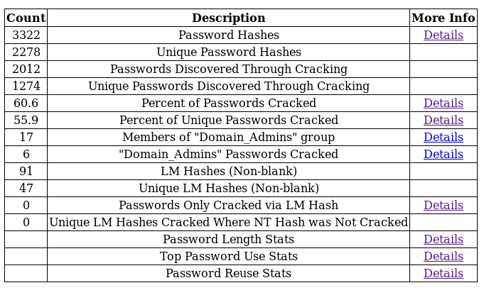

# 密码破解和审计


这是渗透测试中最有趣的部分之一！坐在后面喝杯咖啡，享受密码刷屏几个小时。我是hashcat 的舔狗，所以本文将详细介绍如何使用hashcat。John 是一个可选的替代方案，如果通过用散列与彩虹表进行比较来破解，可以使用Orphcrack，但是我还不打算在本指南中详细介绍它们。


---

## Hashcat

一些有用的链接

* [FAQ](https://hashcat.net/wiki/doku.php?id=frequently_asked_questions#how_can_i_show_previously_cracked_passwords_and_output_them_in_a_specific_format_eg_emailpassword)
* [命令行参数](https://hashcat.net/wiki/doku.php?id=hashcat)
* [hashat 模式码](https://hashcat.net/wiki/doku.php?id=example_hashes)
* [Hashview, hashcat的web前端](http://www.hashview.io/screenshots.html)

Hashcat可以用GPU破解各种哈希。在这些例子中，最需要破解的是NTLM哈希、Kerberost tickets 和其他您可能偶然发现的东西，比如 Keepass 数据库。其目标自然是尽量快地破解，你会看到一堆垃圾密码。我强烈建议搞一个牛X点的GPU，这样就开心许多。即使我的GTX 1060 3GB并不咋地，我还是用它破解NTLM。

最基本的 hashcat 攻击是基于字典。意思就是为字典中的每个条目计算哈希，并与要破解的哈希进行比较。hashcat语法很好理解，但你需要知道hashcat的各种“modes”的用法，这些可以在上面的实用链接部分有。为了快速查找，我在下面列出一些在 AD 环境中最常用的。


| mode | 哈希 | 描述 |
| ------------ | --------------- | ------------------------------- |
| 1000 | NTLM | 很常见，用于一般域身份验证 |
| 1100 | MsCache | 老版本的域缓存凭据 |
| 2100 | MsCache v2 | 新版本的域缓存凭据 |
| 3000 | LM | 很少用，也是老版本（仍然是NTLM的一部分）|
| 5500 | NetNTLMv1 / NetNTLMv1+ESS | 通过网络进行身份验证的NTLM |
| 5600 | NetNTLMv2 | 通过网络进行身份验证的NTLM |
| 7500 | Kerberos 5 AS-REQ Pre-Auth etype 23 | AS_REQ 是 Kerberoas 的初始用户身份认证请求 |
| 13100 | Kerberos 5 TGS-REP etype 23 | TGS_REP 是票据授权服务器(TGS)对先前请求的回复 |

### 字典攻击

对字典攻击来说，字典的质量是最重要的。它可以很大，可以覆盖很大范围。这对于像 NTLM 这种破解代价很低散列很有用，但是对于像 MsCacheV2 这种很难破解的散列来说，您通常希望基于 OSINT 和某些假设或枚举（比如密码策略）得到更精炼的列表，并应用规则。

这是一个使用世界著名字典 rockyou 进行字典破解的例子。

```bash
hashcat64.exe -a 0 -m 1000 ntlm.txt rockyou.txt
```

这种方法的局限性和所有字典攻击一样，如果字典里没有正确的密码，就不能破解。于是就有了基于规则的破解。

### 基于规则的破解

规则就是对单词进行不停额修改，比如剪切或者扩展单词，或者添加一些字母特殊字符之类的。跟字典破解一样，这也需要一个很大的规则列表，基于规则的攻击基本上类似于字典攻击，但是增加了一些对单词的修改，这自然增加了我们能够破解的哈希。

hashcat有一些自带的规则，比如dive。但是人们已经使用统计数据来尝试生成更高效的破解规则。本文详细描述了一个名为 [One Rule to Rule Them All](https://www.notsosecure.com/one-rule-to-rule-them-all/) 的规则集，可以从Github上下载。我用这个规则已经取得了很大的成功，而且统计数据证明它是非常好的。如果想用更少的规则更快地破解，那么 hashcat 中有很多内置的规则，比如 best64.rule。使用 best64 规则集y运行rockyou

```bash
hashcat64.exe -a 0 -m 1000 -r ./rules/best64.rule ntlm.txt rockyou.txt
```

这里你可以把字典和规则都尝试下，只要你的gpu和散热足够屌，你就可以上天。

在破解一定数量的哈希之后，将破解的密码输出到一个文件里.

`--out-file 2` 表示只输出密码。

```
hashcat64.exe -a 0 -m 1000 ntlm.txt rockyou.txt --outfile cracked.txt --outfile-format 2
Recovered........: 1100/2278 (48.28%)
```

继续以破解的密码作为单词列表再次破解，并设置一个大规则集以恢复更多密码。你可以这样循环几次，这样你可以用这个技术破解大量密码。

```bash
hashcat64.exe -a 0 -m 1000 ntlm.txt cracked.txt -r .\rules\OneRuleToRuleThemAll.rule
​
Recovered........: 1199/2278 (52.63%)
​
hashcat64.exe -a 0 -m 1000 ntlm.txt cracked.txt -r .\rules\dive.rule
​
Recovered........: 1200/2278 (52.68%)
```

使用 .pass_2a(90GB) 字典和 .uleulethemall 规则集的究极攻击。

```bash
hashcat64.exe -a 0 -m 1000 ntlm.txt weakpass_2a.txt -r .\rules\oneruletorulethem.rule
```

### 掩码攻击

尝试给定字符空间的所有组合。很像暴力破解，但是更加具体一点。

```bash
hashcat64.exe -a 3 -m 1000 ntlm.txt .\masks\8char-1l-1u-1d-1s-compliant.hcmask
```

### 一些建议

* [Seclists](https://github.com/danielmiessler/SecLists) - 所有类型列表的一个大集合，不仅仅用于密码破解
* [Weakpasswords](https://weakpass.com/) - 有许多又小又好的字典，它们都带有统计信息和用于估计破解时间的计算器。我列出了其中一些，下面这些你也应该知道。
* rockyou.txt - 老牌，稳定，高效
* norsk.txt - 通过下载维基百科和许多挪威语字典来制作一个挪威语字典，并把它们结合在一起，再去重。
* weakpass_2a - 90 GB 字典
* [​Keyboard-Combinations.txt](https://github.com/danielmiessler/SecLists/blob/5c9217fe8e930c41d128aacdc68cbce7ece96e4f/Passwords/Keyboard-Combinations.txt) - 这是按照QWERTY键盘布局上的常规模式列出的所谓的键盘走动列表。参见下面的章节。

#### 生成你自己的字典

有时候，网上的字典并不会删减，所以你必须自己制作。有几种情况必须自己做字典。
1. 需要一个非英语字典
2. 需要一个按键字典
3. 需要一个有针对性的字典

#### 非英语字典

对于第一种情况，我的朋友 @tro 和我分享了他的技巧。我们下载了给定语言的维基百科，然后用一句话对其进行处理，对其进行精简并且去除所有特殊字符。

```bash
wget http://download.wikimedia.org/nowiki/latest/nowiki-latest-pages-articles.xml.bz2
​
bzcat nowiki-latest-pages-articles.xml.bz2 | grep '^[a-zA-Z]' | sed 's/[-_:.,;#@+?{}()&|§!¤%`<>="\/]/\ /g' | tr ' ' '\n' | sed 's/[0-9]//g' | sed 's/[^A-Za-z0-9]//g' | sed -e 's/./\L\0/g' | sed 's/[^abcdefghijklmnopqrstuvwxyzæøå]//g' | sort -u | pw-inspector -m1 -M20 > nowiki.lst
​
wc -l nowiki.lst
3567894
```

完美，我们在很短时间内获得35万字典。

另外一种获得指定语言字典的方法就是使用google和一个特别的网站github，用google搜索一下就可以得到你想要的。

```bash
greek wordlist site:github.com
greek dictionary site:github.com
```

还有我注意到我拉取下来的列表中，有一些类似于ÆØÅ的字符有时候被一些特殊字符替换了，所以记住下载完成之后快速浏览一下你的列表，如果有必要的话做一些替换。

当你下载完成并且解决了一些潜在的错误之后，用linux命令行对其进行分割，删除特殊字符，并且统一转换成小写。

```bash
sed -e 's/[;,()'\'']/ /g;s/ */ /g' list.txt | tr '[:upper:]' '[:lower:]' > newlist.txt
```

你现在应该有了一个又好又漂亮的特定语言的字典。 也应该理解为什么要学习类似 cut, tr, sed, awk, piping 的东西，于此同时，也应该知道重定向是一个多么该死的应用。

#### Bonus

这样你就可以获得名词和地名的列表，它们经常被用作密码，人们都爱自己的孩子和孙子，因此常用他们的名字作为密码。我稍微google了一下，从github上发现了这些，这些都是json格式的，但这不是问题。

linux 大法好
```bash
cat *.json | sed 's/,/\n/g' | cut -f '"' -f2 | sort -u > nornames.txt
​
wc -l nornames.txt
9785
```

现在我们又添加了一些单词。

我把这个添加到我的挪威列表里面并且去重，把他们放到一个文件里。

```bash
cat norsk.txt nor_names.txt sort -u > norsk.txt
​
wc norsk.txt -l
2191221
```

nice，又多了200万个不同的挪威单词。

#### 键盘漫步字典

键盘漫步是按照QWERTY键盘布局上的常规模式来创建容易记住的密码。显然，人们认为这样会生成安全的密码，但实际上它们是高度可预测的。因此，可以从键图生成这些组合，并且很容易做成字典。

几年前，Hashcat 发布了一个叫做 [kwprocessor](https://github.com/hashcat/kwprocessor) 的键盘漫步生成器。您可以使用它来基于多个模式和长度生成相当大的列表。生成2-16字符长列表的示例如下。

```bash
/kw.out -s 1 basechars/full.base keymaps/en.keymap routes/2-to-16-max-3-direction-changes.route -o words.txt
```

记住，在这个字典里运行基于规则的攻击不一定有意义。

另外一个选择就是使用上面提到的 `Keyboard-Combinations.txt`。

#### 目标字典

通常，在实际渗透测试项目中，您所处的企业具有非常特定的名称和细节信息。人们常常为服务帐户和用户帐户设置带有公司名称的密码。一个非常简单的技巧就是将一些公司相关名称写入一个列表，但更有效的方法是在企业的公共网站上使用Web爬虫工具 Cewl。

```bash
cewl -w list.txt -d 5 -m 5 http://example.com
```

我们应该有一个相当大的字典，它基于与该企业相关的词汇，比如名称、地点以及它们的许多商业术语。

另外一种针对性的策略就是使用用户名作为字典进行破解，但是要注意，很多密码策略是不允许这样设置密码的。

于此同时，如果你已经从域控制器中dump了数据库，那么你可能有所有员工的全名，一个技巧就是用他们的姓和名作为字典，用规则进行密码破解。这样可能提供一些额外的结果。

### 你能用到的一些hashcat选项

* 输出还没有破解的哈希 `--left`
* 以 hash:password 的形式输出已经破解的密码 `--show`
* 以 username:hash:password 的形式输出已经破解的密码。 `--show --username`
* 用 `-w <number>` 烧你的gpu，等级是 1-3
* 将已经破解的密码输出到文件 `--show --outfile cracked.txt --outfile-format 2 ` - 其中2表示输出结果。
* 让hashcat以会话的形式启动， 它可以暂停，并且使用`--session <session_name>` 的形式恢复。你可以在暂停会话的时候指定会话名。

## 在线hash破解工具

老实说，我不喜欢使用这些工具，尤其是不在实际渗透测试项目中使用。您不想向在线存储库提交一些你自己都不知道的东西以供永久存储。很奇怪，它永远不会被探测到，但还是要小心。如果你要提交来来自验室的散列或您已经知道明文的散列，那么Crackstation.net 是一个不错的选择。


## 域密码审计工具(DPAT)

一个python脚本，它将根据从域控制器转储的密码散列和密码破解文件（比如Hashcat生成的hashcat.potfile）生成密码使用统计数据。该报告是一个带有链接的HTML页面。

在包含散列文件（`username:lm:nt:`）和包含破解散列的potfile 上运行DPAT。以“domainusername”的格式将域管理列表添加到名为Domain_Admins的文件中。然后它也会显示你破解了多少人的密码。emmm

```bash
./dpat.py -n onlyntlm.txt -c hashcat.potfile -g Domain_Admins
```

打开html报告，感受一下




## 其他

### 清理

在破解了散列并交付报告之后，您可能需要同时清除哈希和破解密码。这很重要，因为您不想外泄或丢失企业的大量密码。对文件要非常小心，尤其是重定向到新文件时。记住要清理你的potfile，因为哈希是在破解之后存储在那里的。

### 彩虹表

彩虹表就是当哈希没有加盐的时候（比如NTLM），提前计算好哈希，并且在破解的时候直接比较。

[免费的彩虹表](https://web.archive.org/web/20160402172945/https://www.freerainbowtables.com/en/tables2)