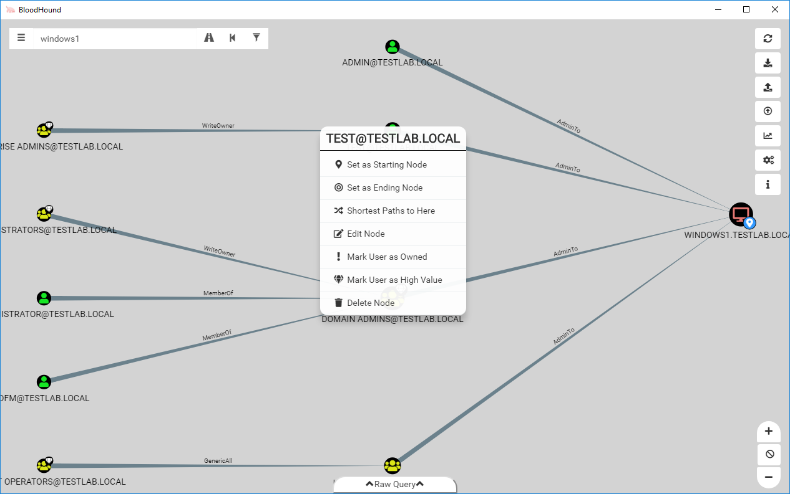
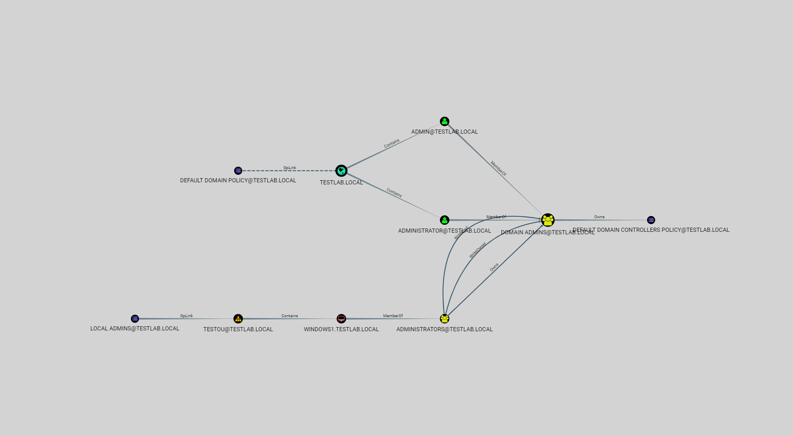

# BloodHound
BloodHound 绘制 Active Directory 和发现攻击路径的工具。

---
## 使用BloodHound映射AD
AD有一个非常好的特性，域中的每个用户都知道所有资源的位置信息。所以当你获得域中一个用户的凭证或者shell时，你可以在不破坏任何规则的前提下映射整个域。任何用户都可以向Active Directory请求计算机，域控制器，组和会话。

所以我们可以使用这个特性收集大量的信息，并且画出一个特别牛X的AD的地图。首先，有两个需要预先安装的软件，你需要安装BLoodHound和一个数据库去存储数据。我们建议您使用`neo4j`，下面是具体步骤。



## 安装 neo4j
### Linux

* 手动从官网安装[社区版](https://neo4j.com/download/community-edition/) (不是用apt)。
* <http://neo4j.com/download/other-releases/#releases​>
* 用 `/opt/neo4j-community-3.3.0/bin/neo4j start` 命令安装neo4j。
* 用浏览器访问 `localhost:7474`。
* 用 用户名 和 密码 `neo4j`登录。
* 为`neo4j`账户设置新密码。
* 在 `neo4j`安装目录中打开`neo4j.conf`文件并且设置以下变量，这样每个主机都可以访问数据库。

```bash
dbms.connector.http.enabled=true
dbms.connector.http.listen_address=0.0.0.0:7474
```

* 运行 `/opt/neo4j-community-3.1.1/bin/neo4j`重启`neo4j`。
* 使用浏览器访问 `http://0.0.0.0:7474/browser/`。

### Windows
Neo4j 可以用Powershell启动

* `powershell -exec bypass` 搞出一个管理员权限的Powershell。
*  切换到 `neo4j/bin` 目录。
*  `Import-Module .\Neo4j-Management.psd1`
*  `Invoke-Neo4j Console`
*  和 Linux 一样，在浏览器中打开 `localhost:7474` 并且修改密码

### MacOS
和Linux的安装过程一样，Neo4j不支持 java 9，所以 Java SDK 的版本必须是 8.
在 Homebrew 中使用 cask 安装 java 8。

* `brew update`
* `brew cask install java8`

## 初探 Bloodhound

* 根据 [git page](https://github.com/BloodHoundAD/BloodHound/wiki/Getting-started) 的教程安装 Bloodhound。
* 启动 BloodHound 并且使用之前设置的密码登录 neo4j 数据库。

## 数据收集
将数据收集为 BloodHound 可以读取的形式，这被称为”摄取“(ingestion)。有很多方法可以实现，并且实现方法也不尽相同。最常用的是 SharpHound (C# ingestor) 和 Invoke-BloodHound (Powershell ingestor)。他们都在i最新的发行版中被捆绑安装。

在 Bloodhound [version 1.5](https://github.com/BloodHoundAD/BloodHound/releases/tag/1.5)中，容器被更新，你可以使用几乎所有的收集器，详细信息参见博客 [Specter Ops](https://posts.specterops.io/bloodhound-1-5-the-container-update-fdf1ed2ad9da)。

### Powershell ingestion
如果你可以访问内网，我建议你在你自己的机器上使用 `runas /netonly` 命令运行 Bloodhound，不要在你不能控制的机器上使用。这样你就不用上传一堆文件弄乱那台域里的机器。你也不会触发反病毒软件，时也不必偷偷把数据搞到自己的机器上，所以说这样动静会小点。

```bash
runas /netonly /FQDN\user\<username> powershell
```
举例说明，在域 `testlab.local` 中，用户名为 `testuser`。
```bash
runas /netonly /testlab.local\user\testuser powershell 
```
按要求输入testuser的密码，这将产生一个新的Powershell窗口，这个窗口将使用本地dns设置找到最近的域控制器，并且执行BloodHound执行的各种LDAP查询。打开一个运行策略设置为bypass的Powershell，加载Powershell模块 `Import-module SharpHound.ps1`。

然后开始收集数据。下面这个命令指定收集所有信息，并把它们压缩到一个zip文件中，并且删除收集过程中所有散落的csv文件。
```Powershell
Invoke-BloodHound -CollectionMethod All -CompressData -RemoveCSV
```
现在在你运行脚本的目录底下会产生一个包含许多csv文件的zip文件。从v2.0开始，这个文件可以i直接被拖到BloodHound接口上。

你可以立即看到数据被填入数据库和接口中。

这样你就可以操作BloodHound来创建一些非常吊的地图。你也可以执行查询并展示出到DA的最短路径，等等。参阅 `默认查询` 和  SpectreOps 的博客文章获取更多的灵感。



#### kali中用 Python 摄取(ingestion)

如果你在本地网络中有一台机器装了python，你可以使用 [BloodHound.py ingestor](https://github.com/fox-it/BloodHound.py)

### 更多关于 BloodHound

对在节点信息下搜集到的东西的解释。
<https://github.com/BloodHoundAD/BloodHound/wiki/Users>
<https://posts.specterops.io/sharphound-target-selection-and-api-usage-bba517b9e69b>
<https://porterhau5.com/blog/representing-password-reuse-in-bloodhound/>
<https://porterhau5.com/blog/extending-bloodhound-track-and-visualize-your-compromise/>
<http://threat.tevora.com/lay-of-the-land-with-bloodhound/>